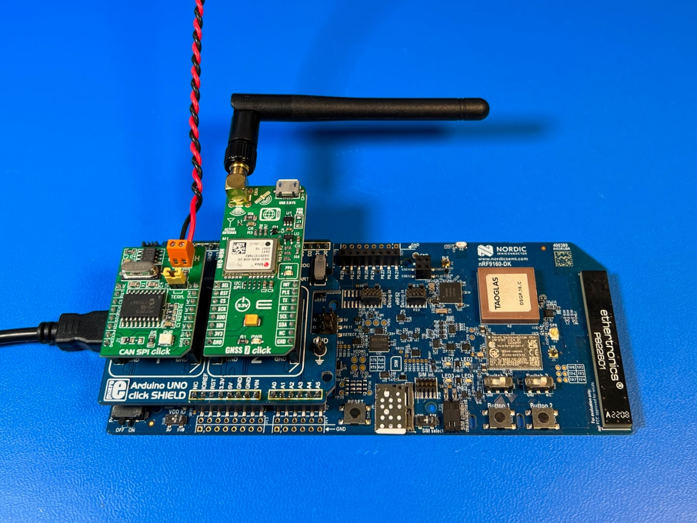
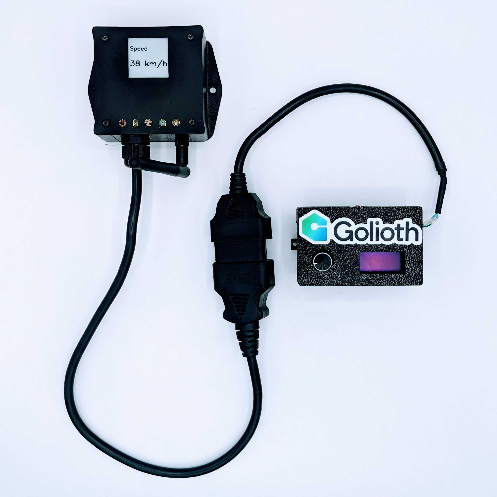

# Golioth ODB-II / CAN Asset Tracker Reference Design

This repository contains the firmware source code and [pre-built release
firmware
images](https://github.com/golioth/reference-design-can-asset-tracker/releases)
for the Golioth OBD-II / CAN Asset Tracker reference design.

The full project details are available on the [OBD-II / CAN Asset
Tracker Project
Page](https://projects.golioth.io/reference-designs/can-asset-tracker/),
including follow-along guides for building an OBD-II / CAN Asset Tracker
yourself using widely available off-the-shelf development boards.

We call this **Follow-Along Hardware**, and we think it's one of the
quickest and easiest ways to get started building an IoT
proof-of-concept with Golioth. In the follow-along guides, you will
learn how to assemble the hardware, flash a pre-built firmware image
onto the device, and connect to the Golioth cloud in minutes.

Once you have completed a follow-along guide for one of our supported
hardware platforms, the instructions below will walk you through how to
build and configure the firmware yourself.

## Supported Hardware

This firmware can be built for a variety of supported hardware
platforms.

> In Zephyr, each of these different hardware variants is given a unique
> "board" identifier, which is used by the build system to generate
> firmware for that variant.
>
> When building firmware using the instructions below, make sure to use
> the correct Zephyr board identifier that corresponds to your
> follow-along hardware platform.

| Hardware                                              | Zephyr Board           | Follow-Along Guide                                                                                                |
| ----------------------------------------------------- | ---------------------- | ----------------------------------------------------------------------------------------------------------------- |
|  | `nrf9160dk_nrf9160_ns` | [nRF9160 DK Follow-Along Guide](https://projects.golioth.io/reference-designs/can-asset-tracker/guide-nrf9160-dk) |

**Follow-Along Hardware**

| Hardware                                                        | Zephyr Board                     | Project Page                                                                                                |
| --------------------------------------------------------------- | -------------------------------- | ----------------------------------------------------------------------------------------------------------- |
|  | `aludel_mini_v1_sparkfun9160_ns` | [OBD-II / CAN Asset Tracker Project Page](https://projects.golioth.io/reference-designs/can-asset-tracker/) |

**Custom Golioth Hardware**

## Local set up

> Do not clone this repo using git. Zephyr's `west` meta tool should be
> used to set up your local workspace.

### Install the Python virtual environment (recommended)

``` shell
cd ~
mkdir golioth-reference-design-coldchain
python -m venv golioth-reference-design-coldchain/.venv
source golioth-reference-design-coldchain/.venv/bin/activate
pip install wheel west
```

### Use `west` to initialize and install

``` shell
cd ~/golioth-reference-design-coldchain
west init -m https://github.com/golioth/reference-design-coldchain.git .
west update
west zephyr-export
pip install -r deps/zephyr/scripts/requirements.txt
```

## Building the application

Build the Zephyr sample application for the [Nordic nRF9160
DK](https://www.nordicsemi.com/Products/Development-hardware/nrf9160-dk)
(`nrf9160dk_nrf9160_ns`) from the top level of your project. After a
successful build you will see a new `build` directory. Note that any
changes (and git commits) to the project itself will be inside the `app`
folder. The `build` and `deps` directories being one level higher
prevents the repo from cataloging all of the changes to the dependencies
and the build (so no `.gitignore` is needed).

Prior to building, update `VERSION` file to reflect the firmware version
number you want to assign to this build. Then run the following commands
to build and program the firmware onto the device.

> You must perform a pristine build (use `-p` or remove the `build`
> directory) after changing the firmware version number in the `VERSION`
> file for the change to take effect.

``` text
$ (.venv) west build -p -b nrf9160dk/nrf9160/ns --sysbuild app
$ (.venv) west flash
```

Configure PSK-ID and PSK using the device shell based on your Golioth
credentials and reboot:

``` text
uart:~$ settings set golioth/psk-id <my-psk-id@my-project>
uart:~$ settings set golioth/psk <my-psk>
uart:~$ kernel reboot cold
```

## Add Pipeline to Golioth

Golioth uses [Pipelines](https://docs.golioth.io/data-routing) to route
stream data. This gives you flexibility to change your data routing
without requiring updated device firmware.

Whenever sending stream data, you must enable a pipeline in your Golioth
project to configure how that data is handled. Add the contents of
`pipelines/batch-json-to-lightdb-stream.yml` as a new pipeline as
follows:

> 1.  Navigate to your project on the Golioth web console.
> 2.  Select `Pipelines` from the left sidebar and click the `Create`
>     button.
> 3.  Give your new pipeline a name and paste the pipeline configuration
>     into the editor.
> 4.  Click the toggle in the bottom right to enable the pipeline and
>     then click `Create`.

All data streamed to Golioth in JSON format will now be routed to
LightDB Stream and may be viewed using the web console. You may change
this behavior at any time without updating firmware simply by editing
this pipeline entry.

## Golioth Features

The OBD-II / CAN Asset Tracker Reference Design connects to the OBD-II
diagnostic port in a vehicle and continuously records vehicle sensor
values using the ISO 15765 (CAN bus) protocol.

Specifically, the following OBD-II vehicle sensor "PIDs" are supported:

  - `0x0D`: Vehicle Speed Sensor (VSS)

The vehicle sensor values are combined with GPS location/time data and
uploaded to the Golioth Cloud. The timestamp from the GPS reading is
used as the timestamp for the data record in the Golioth LightDB Stream
database.

GPS readings can be received as frequently as once-per-second. When the
device is out of cellular range, the reference design firmware caches
data locally and uploads it later when connection to the cellular
network is restored.

### Supported Golioth Zephyr SDK Features

This firmware implements the following features from the Golioth Zephyr
SDK:

  - [Device Settings
    Service](https://docs.golioth.io/firmware/zephyr-device-sdk/device-settings-service)
  - [LightDB State
    Client](https://docs.golioth.io/firmware/zephyr-device-sdk/light-db/)
  - [LightDB Stream
    Client](https://docs.golioth.io/firmware/zephyr-device-sdk/light-db-stream/)
  - [Logging
    Client](https://docs.golioth.io/firmware/zephyr-device-sdk/logging/)
  - [Over-the-Air (OTA) Firmware
    Upgrade](https://docs.golioth.io/firmware/device-sdk/firmware-upgrade)
  - [Remote Procedure Call
    (RPC)](https://docs.golioth.io/firmware/zephyr-device-sdk/remote-procedure-call)

#### Device Settings Service

The following settings can be set in the Device Settings menu of the
[Golioth Console](https://console.golioth.io).

  - `LOOP_DELAY_S`
    Adjusts the delay between sensor readings. Set to an integer value
    (seconds).

    Default value is `5` seconds.

  - `GPS_DELAY_S`
    Adjusts the delay between recording GPS readings. Set to an integer
    value (seconds).

    Default value is `3` seconds.

  - `FAKE_GPS_ENABLED`
    Controls whether fake GPS position data is reported when a real GPS
    location signal is unavailable. Set to a boolean value.

    Default value is `false`.

  - `FAKE_GPS_LATITUDE`
    Sets the fake latitude value to be used when fake GPS is enabled.
    Set to a floating point value (`-90.0` to `90.0`).

    Default value is `37.789980`.

  - `FAKE_GPS_LONGITUDE`
    Sets the fake longitude value to be used when fake GPS is enabled.
    Set to a floating point value (`-180.0` to `180.0`).

    Default value is `-122.400860`.

  - `VEHICLE_SPEED_DELAY_S`
    Adjusts the delay between vehicle speed readings. Set to an integer
    value (seconds).

    Default value is `1` second.

#### LightDB Stream Service

Vehicle data is periodically sent to the following endpoints of the
LightDB Stream service:

  - `gps/lat`: Latitude (°)
  - `gps/lon`: Longitude (°)
  - `gps/fake`: `true` if GPS location data is fake, otherwise `false`
  - `vehicle/speed`: Vehicle Speed (km/h)

On hardware platforms with support for battery monitoring, battery
voltage and level readings are periodically sent to the following
`battery/*` endpoints:

  - `battery/batt_v`: Battery Voltage (V)
  - `battery/batt_lvl`: Battery Level (%)

#### LightDB State Service

The concept of Digital Twin is demonstrated with the LightDB State
`example_int0` and `example_int1` variables that are members of the
`desired` and `state` endpoints.

  - `desired` values may be changed from the cloud side. The device will
    recognize these, validate them for \[0..65535\] bounding, and then
    reset these endpoints to `-1`
  - `state` values will be updated by the device whenever a valid value
    is received from the `desired` endpoints. The cloud may read the
    `state` endpoints to determine device status, but only the device
    should ever write to the `state` endpoints.

#### Remote Procedure Call (RPC) Service

The following RPCs can be initiated in the Remote Procedure Call menu of
the [Golioth Console](https://console.golioth.io).

  - `get_network_info`
    Query and return network information.

  - `reboot`
    Reboot the system.

  - `set_log_level`
    Set the log level.

    The method takes a single parameter which can be one of the
    following integer values:

      - `0`: `LOG_LEVEL_NONE`
      - `1`: `LOG_LEVEL_ERR`
      - `2`: `LOG_LEVEL_WRN`
      - `3`: `LOG_LEVEL_INF`
      - `4`: `LOG_LEVEL_DBG`

## Hardware Variations

This reference design may be built for a variety of different boards.

Prior to building, update `VERSION` file to reflect the firmware version
number you want to assign to this build. Then run the following commands
to build and program the firmware onto the device.

### Noric nRF9160 DK

This reference design may be built for the Nordic nRF9160 Cellular IoT
Development Kit.

``` text
$ (.venv) west build -p -b nrf9160dk/nrf9160/ns --sysbuild app
$ (.venv) west flash
```

### Golioth Aludel Mini

This reference design may be built for the Golioth Aludel Mini board.

``` text
$ (.venv) west build -p -b aludel_mini/nrf9160/ns --sysbuild app
$ (.venv) west flash
```

### Golioth Aludel Elixir

This reference design may be built for the Golioth Aludel Elixir board.
By default this will build for the latest hardware revision of this
board.

``` text
$ (.venv) west build -p -b aludel_elixir/nrf9160/ns --sysbuild app
$ (.venv) west flash
```

To build for a specific board revision (e.g. Rev A) add the revision
suffix `@<rev>`.

``` text
$ (.venv) west build -p -b aludel_elixir@A/nrf9160/ns --sysbuild app
$ (.venv) west flash
```

## OTA Firmware Update

This application includes the ability to perform Over-the-Air (OTA)
firmware updates:

1.  Update the version number in the
    <span class="title-ref">VERSION</span> file and perform a pristine
    (important) build to incorporate the version change.
2.  Upload the
    <span class="title-ref">build/app/zephyr/zephyr.signed.bin</span>
    file as an artifact for your Golioth project using
    <span class="title-ref">main</span> as the package name.
3.  Create and roll out a release based on this artifact.

Visit [the Golioth Docs OTA Firmware Upgrade
page](https://docs.golioth.io/firmware/golioth-firmware-sdk/firmware-upgrade/firmware-upgrade)
for more info.

## External Libraries

The following code libraries are installed by default. If you are not
using the custom hardware to which they apply, you can safely remove
these repositories from `west.yml` and remove the includes/function
calls from the C code.

  - [golioth-zephyr-boards](https://github.com/golioth/golioth-zephyr-boards)
    includes the board definitions for the Golioth Aludel-Mini
  - [libostentus](https://github.com/golioth/libostentus) is a helper
    library for controlling the Ostentus ePaper faceplate
  - [zephyr-network-info](https://github.com/golioth/zephyr-network-info)
    is a helper library for querying, formatting, and returning network
    connection information via Zephyr log or Golioth RPC
